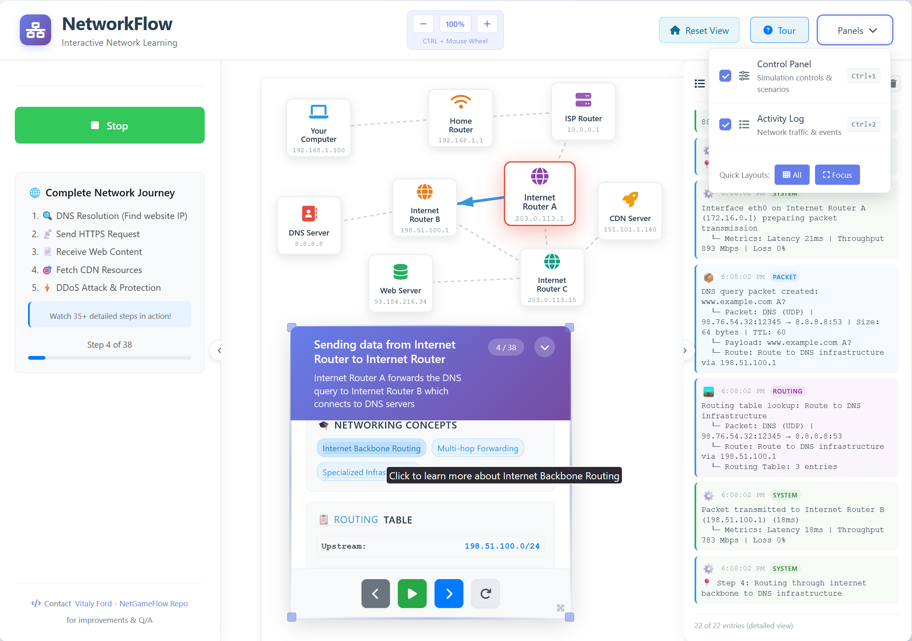

# NetGameFlow

<div align="center">

[](https://reactjs.org/)
[](https://www.typescriptlang.org/)
[](https://bun.sh/)
[](https://vitejs.dev/)
[](https://netflow.vford.com)

</div>

An interactive network simulator that makes internet concepts easy to understand. Watch how data travels from your computer to websites through routers, DNS servers, and the internet backbone with step-by-step visualization and security simulations.



NetGameFlow makes networking and security concepts accessible through hands-on visualization. Whether you're a student learning about the internet, a professional exploring cybersecurity, or someone curious about how data travels when you click a link, this tool helps you see and understand the invisible infrastructure and security measures that power our connected world.

## Features

- **Interactive Network Visualization**: See how data flows through the internet in real-time
- **Educational Popups**: Click any device to learn what it does in simple terms
- **Step-by-Step Tours**: Follow packets on their journey from your computer to websites
- **Realistic Network Scenarios**: DNS resolution, web requests, CDN delivery, and DDoS attacks
- **Security Simulations**: Experience DDoS attacks, botnet operations, and Cloudflare protection
- **Draggable Network Topology**: Move devices around and drag the entire canvas to explore the network layout
- **Activity Logging**: Track network events, security threats, and packet flow with detailed categorization
- **Resizable Panels**: Customize your learning experience with flexible panel layout
- **Welcome Guide**: Built-in tutorial to get you started
- **Keyboard Shortcuts**: Quick panel management and navigation
- **Attack State Visualization**: See devices under attack, in recovery, or protected states
- **Canvas Dragging**: Pan across the network topology for better exploration

## Getting Started

You need Bun runtime installed. Download it from https://bun.sh

```bash
# Install dependencies
bun install

# Start the development server
bun dev

# Run tests
bun test

# Run tests with UI
bun test:ui

# Run tests with coverage
bun test:coverage

# Lint and fix code
bun lint:fix
```

Open your browser to http://localhost:5173

## Building for Production

```bash
bun run build
bun run preview
```

## How to Use

The NetworkFlow interface is designed to be intuitive and educational:

### Main Components

- **Network Canvas**: The main area showing devices connected by lines. You can drag devices around and the connections will follow
- **Control Panel**: On the left side (when visible) - contains simulation controls and scenario selection (just one scenario right now)
- **Activity Log**: On the right side (when visible) - shows real-time network events
- **Header Controls**: Panel management and canvas reset options

### Getting Started

1. **Welcome Guide**: First-time users see a welcome popup with a guided tour option
2. **Click Devices**: Click any device (computer, router, server) to learn what it does
3. **Start a Simulation**: Use the control panel to begin step-by-step packet tracking
4. **Watch the Journey**: See highlighted connections as data travels through the network

### Step-by-Step Learning

NetGameFlow offers detailed packet journey simulations with advanced security scenarios:

- **DNS Resolution**: See how your computer finds the IP address for a website
- **Web Requests**: Follow HTTPS requests to web servers
- **CDN Delivery**: Watch how content delivery networks speed up the internet
- **DDoS Attack Simulation**: Experience realistic cyber attacks with botnet operations
- **Security Protection**: Learn how Cloudflare and other services protect against attacks
- **Network Recovery**: See how systems recover from security incidents

Each step shows technical details like IP addresses, protocols, routing decisions, and security measures while explaining concepts in simple language.

### Panel Management

- **Toggle Panels**: Use the header dropdown to show/hide control panel and activity log
- **Keyboard Shortcuts**: Ctrl+1 for control panel, Ctrl+2 for activity log
- **Quick Layouts**: "All" button shows everything, "Focus" button hides panels for a clean view
- **Resize Panels**: The step details window can be resized by dragging corners
- **Canvas Navigation**: Drag the canvas background to pan across the network topology
- **Device Movement**: Drag individual devices to reorganize the network layout

### Educational Features

- **Tech Terms**: Clickable technical terms throughout the interface open helpful explanations
- **Device Information**: Each network device has detailed educational content
- **Simple Analogies**: Complex networking concepts explained with everyday comparisons
- **Visual Learning**: Color-coded connections and device states make abstract concepts concrete

## Using as a Component

NetGameFlow can be embedded in other React applications:

```tsx
import { NetworkSimulator } from './src/components/NetworkSimulator';

function App() {
  return (
    <div>
      <h1>My Learning Platform</h1>
      <NetworkSimulator 
        showControls={true}
        showLogger={true}
        autoStart={false}
        initialScenario="basic"
        onStatsChange={(stats) => console.log('Network stats:', stats)}
        onScenarioChange={(scenario) => console.log('Scenario changed:', scenario)}
      />
    </div>
  );
}
```

### Component Properties

- `className`: CSS class for styling
- `showControls`: Show/hide the control panel (default: true)
- `showLogger`: Show/hide the activity log (default: true)  
- `autoStart`: Skip welcome guide and start immediately (default: false)
- `initialScenario`: Starting scenario type (default: 'basic')
- `onStatsChange`: Callback for network statistics
- `onScenarioChange`: Callback when scenario changes

## What You'll Learn

NetGameFlow teaches networking concepts (in a _rudimentary_ way) through interactive visualization with a focus on both infrastructure and security:

### Network Infrastructure
- How your computer connects to the internet through routers
- The role of Internet Service Providers (ISPs)
- How the internet backbone connects everything globally
- The difference between local networks and the public internet
- BGP routing and Autonomous System (AS) paths

### DNS (Domain Name System)
- How "google.com" becomes an IP address like "172.217.164.78"
- The journey of DNS queries through multiple servers
- How caching speeds up repeated requests
- Public DNS servers like Google's 8.8.8.8

### Web Communication
- HTTPS requests and responses
- How web servers process your requests
- Content Delivery Networks (CDNs) and why they matter
- Network Address Translation (NAT) in home routers

### Network Security & Cyber Threats
- Distributed Denial of Service (DDoS) attacks and their impact
- How botnet operations work and coordinate attacks
- How protection services like Cloudflare detect and mitigate threats
- Real-time security monitoring and threat intelligence
- Attack state visualization and recovery processes
- The importance of layered security defenses

### Technical Concepts Made Simple
- IP addresses and routing tables
- Protocols like HTTP, DNS, and TCP
- Packet switching and network hops
- Time To Live (TTL) and packet headers
- Attack vectors and mitigation strategies
- Network performance metrics and monitoring

Each concept is explained with both technical details and everyday analogies to make complex networking and security topics accessible to everyone.

## Project Structure

The app is built with modern Bun, React, TypeScript, Vite, Vitest, and ESLint, and deployed on Cloudflare Workers. Main components:

```
src/
├── components/                         # UI components organized by feature
│   ├── features/
│   │   ├── network/
│   │   │   ├── NetworkSimulator.tsx    # Main application container
│   │   │   ├── Device.tsx              # Interactive network devices
│   │   │   └── Connection.tsx          # Network connection lines
│   │   ├── controls/
│   │   │   ├── ControlPanel.tsx        # Simulation controls
│   │   │   └── StepController.tsx      # Step navigation interface
│   │   ├── logging/
│   │   │   └── Logger.tsx              # Activity log with categorization
│   │   └── education/
│   │       ├── EducationalPopup.tsx    # Learning modal windows
│   │       └── WelcomeGuide.tsx        # First-time user guide
│   └── ui/
│       ├── TechTerm.tsx                # Clickable term explanations
│       └── Tooltip.tsx                 # Hover help text
├── hooks/                              # React custom hooks
│   ├── useNetworkSimulator.ts          # Main simulation logic
│   └── useEducational.ts               # Educational content system
├── contexts/                           # React context providers
│   └── EducationalContext.tsx          # Global educational state
├── types/                              # TypeScript definitions
│   └── index.ts                        # All type definitions
├── utils/                              # Utility functions
│   ├── constants.ts                    # App-wide constants
│   ├── helpers.ts                      # Helper functions
│   └── networkExplanations.ts          # Educational content
├── test/                               # Test setup and utilities
│   └── setup.ts                        # Vitest test configuration
└── App.tsx                             # Root application component
```

## Development

### Code Style
- TypeScript with strict typing throughout
- React functional components with hooks
- CSS modules for component styling
- Feature-based component organization
- Comprehensive error handling and logging

### Adding New Features
- Components go in `src/components/features/` with matching CSS modules
- Logic belongs in custom hooks in `src/hooks/`
- Type definitions are centralized in `src/types/index.ts`
- Educational content is managed in `src/utils/networkExplanations.ts`
- Tests should be co-located with components

### Available Scripts
```bash
bun dev                # Start development server
bun build              # Build for production
bun test               # Run tests in watch mode
bun test:ui            # Run tests with visual UI
bun test:run           # Run tests once
bun test:coverage      # Run tests with coverage report
bun lint               # Check code quality
bun lint:fix           # Fix linting issues
bun type-check         # Type check without building
```

### Key Architecture Principles
- Component-based design with single responsibility
- Business logic separated from UI components
- Educational content separate from application logic
- Responsive design that works on different screen sizes
- Accessibility-first approach with proper ARIA labels
- Performance optimization with React 19 features

## Contributing

If you'd like to help improve NetGameFlow:

1. Fork the repository
2. Create a feature branch
3. Make your changes with appropriate tests
4. Ensure code quality with `bun lint:fix`
5. Run the test suite with `bun test:coverage`
6. Submit a pull request

Please follow the existing code style and add educational content for any new networking concepts you introduce. All new features should include appropriate TypeScript types and test coverage (not that there are any tests yet ;)).

## License

This project is licensed under the MIT License.
Feel free to use, modify, and distribute it as you wish. Contributions are welcome!
